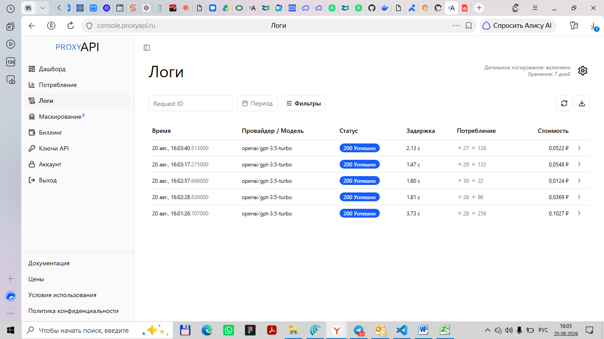

# Telegram-бот с ProxyAPI (LLM)

Telegram-бот на Python (aiogram) с интеграцией LLM через ProxyAPI.

## 📁 Структура проекта

| Файл | Описание |
|---|---|
| `bot.py` | Основной файл — обработчики сообщений и команд |
| `config.py` | Токены и настройки (читает из `.env`) |
| `proxyapi_client.py` | Функция отправки запроса к ProxyAPI |
| `context_manager.py` | Хранение контекста диалога в памяти |
| `.env` | Переменные окружения (токены) |
| `requirements.txt` | Зависимости |

## 🚀 Установка

```powershell
pip install -r requirements.txt
```

## ⚙️ Настройка

1. Получите токен бота у **@BotFather** в Telegram
2. Получите ключ API в [proxyapi.ru](https://proxyapi.ru/)
3. Заполните `.env`:

```env
BOT_TOKEN=ваш_тг_токен
PROXYAPI_KEY=ваш_proxyapi_ключ
```

## ▶️ Запуск

```powershell
python bot.py
```

## 📋 Команды

| Команда | Описание |
|---|---|
| `/start` | Начать новый диалог |
| `/clear` | Очистить историю диалога |
| `/help` | Показать справку |

## 🧪 Тестирование параметров LLM

### Результаты прогонов

Данные из логов ProxyAPI (скриншот ниже):

| № | Запрос | Temperature | Max Tokens | Эффект (сжатость/креатив) | Использовано токенов | Ориент. стоимость |
|---|---|---|---|---|---|---|
| 1 | `python proxyapi_request.py "Твой запрос" 0.0 256` | 0.0 | 256 | Детерминированный, предсказуемый ответ | prompt: 27 → completion: 126 | 0.0522 ₽ |
| 2 | `python proxyapi_request.py "Твой запрос" 0.3 256` | 0.3 | 256 | Сжатый, минимальная креативность | prompt: 29 → completion: 132 | 0.0548 ₽ |
| 3 | `python proxyapi_request.py "Твой запрос" 0.7 1024` | 0.7 | 1024 | Баланс точности и креативности | prompt: 30 → completion: 22 | 0.0124 ₽ |
| 4 | `python proxyapi_request.py "Твой запрос" 1.0 1024` | 1.0 | 1024 | Креативный, развёрнутый ответ | prompt: 28 → completion: 86 | 0.0369 ₽ |
| 5 | `python proxyapi_request.py "Твой запрос" 1.5 2048` | 1.5 | 2048 | Максимально креативный, развёрнутый | prompt: 28 → completion: 256 | 0.1027 ₽ |

> **Примечание:** Данные взяты из логов ProxyAPI. Задержки ответа: от 1.47 с до 3.73 с.



### Как запустить тесты

```powershell
# Прогон 1 — минимальная температура
python proxyapi_request.py "Твой запрос" 0.0 256

# Прогон 2 — низкая температура
python proxyapi_request.py "Твой запрос" 0.3 256

# Прогон 3 — средняя температура
python proxyapi_request.py "Твой запрос" 0.7 1024

# Прогон 4 — высокая температура
python proxyapi_request.py "Твой запрос" 1.0 1024

# Прогон 5 — максимальная температура
python proxyapi_request.py "Твой запрос" 1.5 2048
```

## 📝 Лицензия

MIT
